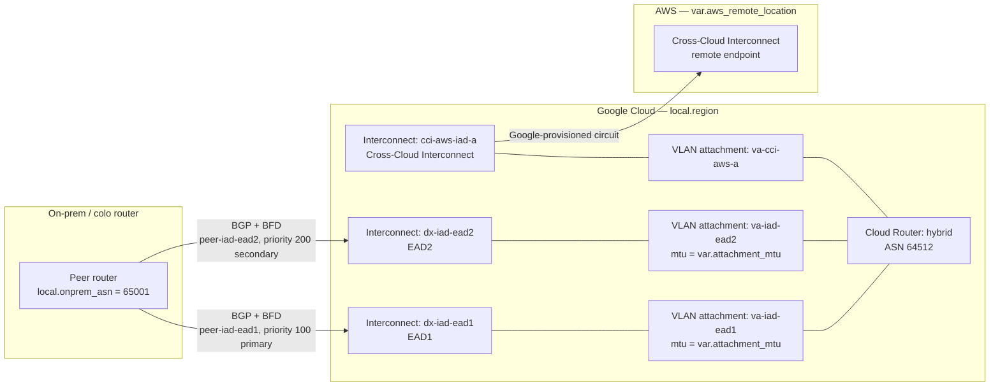
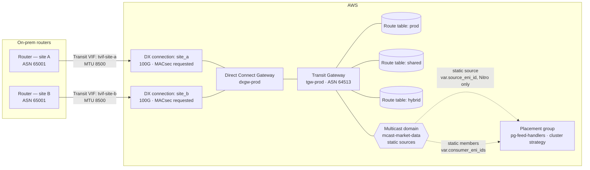
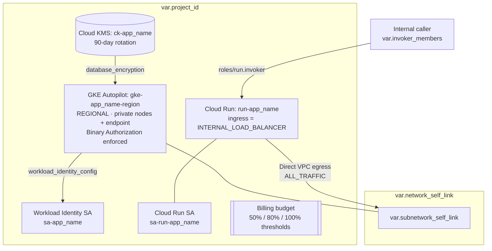

# Examples Index

What's in this directory, and — for each Terraform example — the topology
it actually provisions, so a reader doesn't have to trace resource blocks to
see the shape. Every diagram cites the file it describes; if the two drift
apart, the `.tf` file is authoritative and this diagram is stale.

---

## `terraform-gcp-interconnect.tf`

Two Dedicated Interconnect circuits in one metro, across two edge
availability domains (the 99.9% SLA topology — `07-verified-facts.md` §1),
plus one Cross-Cloud Interconnect pair to AWS. Cloud Router runs BGP with
BFD and explicit route priority on every session.

Repeat this module in a second metro to reach the 99.99% tier — this
diagram, like the file, encodes one metro.

---

## `terraform-aws-directconnect.tf`

Two DX connections at two different physical locations (Multi-Site
Non-Redundant, 99.9% — `07-verified-facts.md` §4), associated to a Direct
Connect Gateway and a Transit Gateway with segmented route tables, plus a
static-mode multicast domain for a bridged on-prem market-data feed
(`07-verified-facts.md` §6) and a cluster placement group for the feed
handlers that consume it.

Add a second connection at each location, on different devices, to reach
Maximum Resiliency (99.99%) — not encoded in this file or diagram.

---

## `terraform-gcp-platform-baseline.tf`

A regional private GKE Autopilot cluster and an internal-only Cloud Run
service, sharing a CMEK key, with Workload Identity (no exported keys) and
a billing budget with 50/80/100% alert thresholds — the golden path a
workload team consumes as a module in under an hour.

Terraform provisions the cluster and the service; it deliberately does not
manage what runs inside the cluster — that's GitOps, coupling the two only
makes both slower.

---

## `cli-cheatsheet.md`

Operational commands, organized by "what you actually do at 03:00": circuit
and BGP/BFD state, NCC, connectivity diagnostics, placement and NIC config,
GKE/Cloud Run/Vertex AI posture, path validation (MTU discovery, p50/p95/p99
latency, throughput), microsecond-latency and kernel-scheduling measurement
for HFT workloads, multicast verification, a guardrail/posture sweep, and a
pre-production sanity checklist. No architecture diagram — it's a reference
card, not a topology.

## Deliverable templates

Not architecture examples — starting points for the durable artefacts this
skill produces, following the structure `agents/fsi-cloud-architect.md` and
`references/06-design-review-checklists.md` already specify:

- **`adr-template.md`** — architecture decision record: context, decision,
  options with a 36-month cost comparison, topology, resiliency tier,
  failure modes, build path, consequences.
- **`migration-plan-template.md`** — waves, cutover approach per wave,
  the "connect the minimum" blast-radius discipline
  (`references/11-ma-cloud-integration.md` §4), rollback plan, cost with
  double-running stated honestly, risk register.
- **`design-review-report-template.md`** — findings table by severity,
  full checklist-section coverage log, resiliency-tier verification,
  sign-off — the format `agents/fsi-cloud-architect.md`'s "How to Work a
  Review Task" section specifies.
