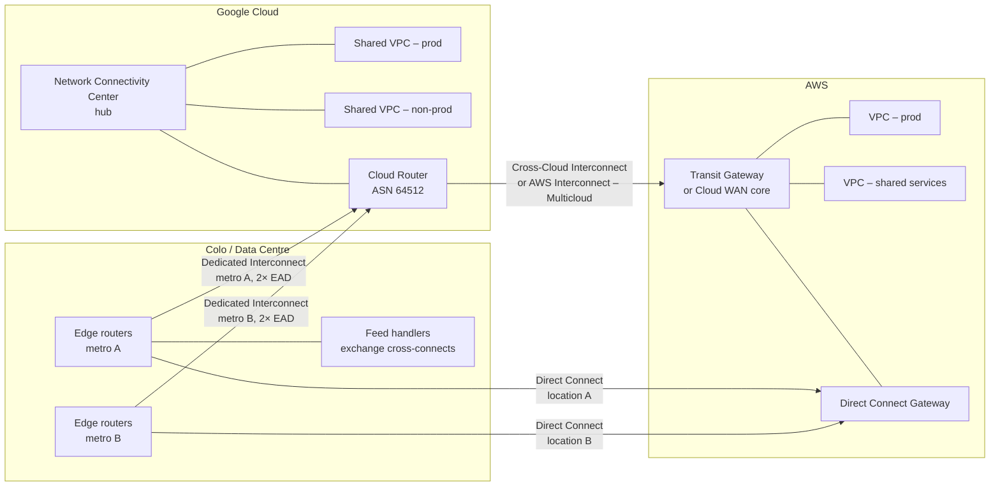

# Hybrid Topology: GCP + AWS + Data Centres

How the three estates fit together: transit design, routing, DNS, identity and
the decision framework for where a workload should live.

---

## 1. The Reference Topology

The pattern that holds for most financial-services estates is **a routing hub per
cloud, joined by managed cross-cloud circuits, with on-prem/colo attached to both
hubs rather than transiting one cloud to reach the other.**

**Why not hairpin one cloud through the other.** Transiting GCP to reach AWS from
on-prem adds a hop, doubles egress charges on the same bytes, couples two
providers' failure domains, and makes the blast radius of a cloud-side change
larger than it needs to be. Attach each site to each cloud directly and let BGP
choose. Use cross-cloud circuits for genuine cloud-to-cloud traffic.

**Exception.** If the estate has one dominant cloud and a small satellite
presence in the other, a single transit path through the dominant cloud is a
defensible simplification. Say so explicitly and record it as a decision.

---

## 2. Google Cloud Transit Building Blocks

| Component | Role | Notes |
| --- | --- | --- |
| **Shared VPC** | One host project owns the network; service projects attach | Default for enterprise. Keeps IP and firewall policy centralised |
| **Network Connectivity Center (NCC)** | Hub for connecting VPC spokes, hybrid spokes (Interconnect/VPN), router appliances | The transit construct. Replaces the old VPC-peering mesh |
| **Cloud Router** | Runs BGP for Interconnect and HA VPN | Per-region. Dynamic routing mode global vs regional matters — see §4 |
| **Private Service Connect (PSC)** | Private consumption of Google and third-party services without VPC peering | Avoids the transitive-peering limitation. 40+ published services |
| **Cloud NGFW / hierarchical firewall policies** | Org- and folder-level enforcement | Policy above the project layer so teams cannot opt out |
| **Cloud DNS** | Private zones, forwarding, peering | See §5 |

Notable 2026 additions: NCC Gateway with third-party SSE integrations,
privately-used public IP (PUPI) support in NCC, static routes with an internal
load balancer as next hop, and hybrid subnets. Verify GA status per
`references/07-verified-facts.md` before committing a design to a preview feature.

**VPC peering is not transitive on GCP.** Spokes attached to NCC get transitivity;
a raw peering mesh does not. Designs that assume "A peers B, B peers C, therefore
A reaches C" are broken.

---

## 3. AWS Transit Building Blocks

| Component | Role | Notes |
| --- | --- | --- |
| **Transit Gateway (TGW)** | Regional hub for VPCs, DX Gateway, VPN, peering | The workhorse. Route tables give segmentation |
| **AWS Cloud WAN** | Global network with policy-as-code segments | Choose over multi-region TGW peering when you have many regions and want central policy |
| **Direct Connect Gateway** | Associates VIFs with VGWs or TGWs, across regions | Global object |
| **PrivateLink / VPC endpoints** | Private service consumption, no route exposure | The right answer for exposing an internal service to another account or partner |
| **Service Control Policies / Resource Control Policies** | Org-level guardrails | Preventive controls; pair with Control Tower |

**TGW route tables are the segmentation primitive.** Model prod / non-prod /
shared-services / inspection as separate route tables with explicit associations
and propagations. Do not rely on security groups alone for tiering.

**Cloud WAN vs TGW.** A single region with a handful of VPCs: TGW. Multi-region
with a need for declarative segment policy and central visibility: Cloud WAN.
Migrating between them is disruptive — decide early.

---

## 4. Routing and Address Planning

### Address plan

Maintain **one authoritative IPAM across all three estates**. Non-negotiable.

- Allocate a distinct supernet per estate and per environment, e.g.
  `10.0.0.0/12` on-prem, `10.16.0.0/12` AWS, `10.32.0.0/12` GCP, each subdivided
  by region then environment.
- Reserve growth: assume the estate doubles. Renumbering a live market data
  platform is a multi-quarter project.
- Never overlap. Where an acquisition brings overlapping space, isolate it behind
  NAT or PUPI and schedule renumbering — do not build permanent NAT hairpins.
- Keep a documented block for cross-cloud transit links and BGP peering addresses,
  separate from workload space.

### BGP policy

Both clouds speak eBGP and both give you enough knobs to make failover
deterministic. Use them.

| Control | GCP | AWS |
| --- | --- | --- |
| Prefer one path inbound to cloud | Cloud Router advertised route **priority** (lower = preferred) | **AS-path prepending** on your advertisement, or DX **local preference communities** (`7224:7100/7200/7300`) |
| Prefer one path outbound from cloud | Your router's local preference | Your router's local preference |
| Limit scope of advertisement | Custom route advertisements per BGP session | VIF-level filtering, DX Gateway allowed prefixes |
| Fast failure detection | BFD on Cloud Router BGP sessions | BFD on DX BGP sessions |
| Graceful restart | Supported | Supported |

Rules that prevent most production incidents:

1. **Enable BFD on every hybrid BGP session.** Default BGP hold timers mean
   ~90 seconds of blackholing. BFD brings this to sub-second. This is the single
   highest-value setting in a hybrid design.
2. **Advertise summaries, not per-subnet routes.** Both clouds cap the number of
   prefixes learned per session. Summarise on-prem space before advertising.
3. **Make active/active explicit.** ECMP across two circuits doubles usable
   bandwidth but means a single circuit failure halves capacity — size each
   circuit for the surviving-path load, not the aggregate.
4. **Test failover, in production, on a schedule.** Shut a BGP session in a
   change window and measure convergence. A resiliency tier that has never been
   exercised is a claim, not a property.
5. **On GCP, choose the Cloud Router dynamic routing mode consciously.** Global
   mode advertises routes from all regions over a regional session; regional mode
   confines them. Global is usually right for hybrid but increases the blast
   radius of a bad advertisement.

---

## 5. Hybrid DNS

The most common cause of "the network is broken" that turns out not to be the
network.

**Target state: one authoritative view of private names, resolvable identically
from any estate.**

| Direction | GCP mechanism | AWS mechanism |
| --- | --- | --- |
| Cloud resolves on-prem names | Cloud DNS **forwarding zone** → on-prem resolvers | **Route 53 Resolver outbound endpoint** + forwarding rules |
| On-prem resolves cloud names | Cloud DNS **inbound server policy** (inbound forwarding IPs) | **Route 53 Resolver inbound endpoint** |
| Cloud A resolves Cloud B names | Forwarding zone → the other cloud's inbound resolver IPs | Forwarding rule → the other cloud's inbound resolver IPs |
| Service discovery within a cloud | Private zones attached to VPCs / NCC hub | Private hosted zones associated to VPCs |

Design notes:

- Put resolver endpoints in **at least two AZs/zones** and reachable over both
  hybrid circuits. A single-AZ resolver endpoint is a single point of failure for
  everything.
- Decide the **authoritative owner of each namespace** and write it down.
  Split-horizon that nobody owns becomes split-brain.
- Watch **query volume limits** on resolver endpoints; a chatty microservice
  estate can exhaust them.
- For PSC and PrivateLink endpoints, resolve to the private endpoint from every
  estate, not just the local one.

---

## 6. Cross-Cloud Identity

Do not create long-lived static credentials to let one cloud call the other.

**GCP calling AWS.** Configure an AWS IAM role with a trust policy accepting the
Google service account's OIDC identity; the GCP workload exchanges its metadata
token for temporary AWS credentials via `AssumeRoleWithWebIdentity`.

**AWS calling GCP.** Configure a GCP **Workload Identity Pool** with an AWS
provider; the AWS workload presents its signed caller identity and receives a
short-lived GCP access token. No exported service account keys.

**Humans.** One identity provider federating to both clouds. Google Cloud
Identity / Workspace or the corporate IdP → AWS IAM Identity Center and GCP
via SAML/OIDC. Permission sets and role bindings mapped from the same group
model, so joiner/mover/leaver is one process.

**Rules:**
- Service account key files and IAM access keys are findings, not options.
- Scope trust policies by subject, audience *and* condition — a pool that trusts
  an entire AWS account is not a control.
- Log federated assumptions to a central SIEM; they are the cross-cloud audit
  trail.

---

## 7. Where Should the Workload Live?

| Workload trait | Put it | Reason |
| --- | --- | --- |
| Sub-100 µs tick-to-trade, exchange-adjacent | Colo, cross-connected to the venue | Cloud cannot reach the latency floor, and proximity is bought physically |
| Feed normalisation, ticker plant | Cloud region nearest the feed source; consider colo ingestion + cloud processing | Cloud-resident market data apps should plan for 10–50 ms end-to-end |
| Tick archive, historical analytics, backtesting | Cloud object storage + elastic compute | Bursty, storage-heavy, latency-insensitive — cloud's best case |
| Client-facing distribution APIs | Cloud, multi-region, behind global LB | Elasticity and edge reach |
| Reference/entity data mastering | Cloud, single authoritative region | Consistency matters more than latency |
| Systems bound by data residency | The estate that satisfies the jurisdiction | See `references/04` |
| Anything already in a stable colo with amortised hardware and no growth | Leave it | Migration cost rarely repays for static workloads |

**The split-plane pattern for market data:** ingest and time-stamp as close to the
venue as possible; normalise, enrich and fan out in cloud; archive in object
storage; serve clients from cloud edge. Draw the boundary where the latency
requirement stops being microseconds.

---

## 8. Load Balancing — ILB / ALB / NLB

Named explicitly in the role definition, and the naming is where GCP and AWS
diverge most from each other. Full product tables and sources in
`07-verified-facts.md` §15 — this is the decision framework.

**Google Cloud** splits its load balancers along two axes: layer (Application
= HTTP/HTTPS, Network = TCP/UDP) and scope (global vs regional, external vs
internal). Network Load Balancer is not one product — it is two: **Proxy**
Network Load Balancer (TCP, optional SSL offload) and **Passthrough** Network
Load Balancer (TCP/UDP/ESP/GRE/ICMP, preserves client source IP). When
someone says "the ILB" in casual conversation they almost always mean the
**internal passthrough Network Load Balancer** — the zonal/regional workhorse
behind most private service-to-service traffic, and the load balancer a PSC
service attachment fronts (`02-private-connectivity.md` §10).

**AWS** keeps three distinct products: **ALB** (Layer 7, path/host routing,
WAF integration — the default web/API front door), **NLB** (Layer 4, static
IP per AZ, the load balancer PrivateLink VPC endpoint services attach to),
and **Gateway Load Balancer** (transparent inline insertion of third-party
appliances — firewalls, IDS/IPS — a narrow, specific case, not a
general-purpose choice).

**Decision rule that resolves most arguments:** HTTP-layer routing, WAF, or
content-based rules → Application Load Balancer (either cloud). Raw TCP/UDP
performance, a static IP, or the load balancer is what a private-endpoint
service attaches to → Network Load Balancer (either cloud, mind GCP's
proxy-vs-passthrough split). Inline traffic inspection → Gateway Load
Balancer, and only for that.

**Cross-cloud consistency for engineering teams:** since GKE and Cloud Run are
the named runtime targets and Lambda is the named AWS serverless target
(`00-role-context.md` §4), the golden paths (`10-cloud-enablement.md` §3)
should default GKE ingress to the internal/external Application Load Balancer
via Gateway API or Ingress, and Cloud Run to its managed HTTPS load balancing
— so an engineering team crossing clouds meets the same HTTP-vs-TCP decision
framed the same way, not two unrelated products to learn from scratch.

---

## 9. Anti-Patterns

| Anti-pattern | What goes wrong |
| --- | --- |
| Public-internet VPN as the primary cross-cloud path at data-plane volume | Jitter, throughput ceilings, and egress billed at the highest rate |
| One cloud transiting the other to reach on-prem | Double egress, coupled failure domains, opaque troubleshooting |
| Full-mesh VPC peering as a transit substitute | Not transitive on GCP; scales quadratically; unmanageable route tables |
| Overlapping RFC1918 "we'll NAT it" | Permanent NAT, broken source IP logging, impossible incident forensics |
| Single-AZ resolver endpoints or single-region DX Gateway assumptions | DNS or routing outage during a normal AZ event |
| Relying on default BGP timers | ~90 s of blackholed traffic on every circuit failure |
| Buying a resiliency tier without building its topology | The SLA does not apply; nobody discovers this until the incident review |
| Copying market data across clouds "because it's easier" | Exchange redistribution licensing exposure plus egress cost |
| Standing up a PSC/PrivateLink endpoint per service past a few dozen | Operational overhead that argues for a hub topology instead (`02-private-connectivity.md` §10) |
