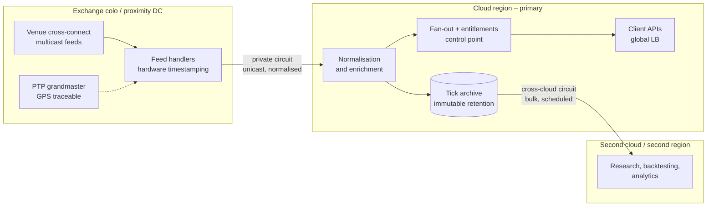

# Low-Latency and Market Data Architecture

Latency budgets, instance and OS tuning, multicast in a world without multicast,
time synchronisation, and the placement decisions that actually determine
performance.

All figures sourced in `references/07-verified-facts.md`.

---

## 1. The Latency Hierarchy — Optimise Top Down

AWS's own analysis frames the orders of magnitude available at each layer. Use it
to stop teams from tuning NIC interrupts when the workload is in the wrong metro.

| Layer | Order of magnitude available |
| --- | --- |
| Region and placement choice | ~100 ms |
| Network path | ~2 ms |
| Instance selection | ~200 µs |
| OS tuning and kernel bypass | ~50 µs |
| Application tuning | ~5 µs |

**Corollary:** a workload in the wrong region cannot be rescued by tuning. Fix
placement first, path second, instance third. Only then reach for kernel bypass.

---

## 2. What Latency Is Actually Achievable

**Cloud-resident market data applications**, end to end, should be planned around
**10–50 ms** — FactSet's own published position. That is entirely adequate for
distribution, analytics, research and client-facing APIs, and unsuitable for
execution.

**Instance-to-instance round trip inside a cloud**, well tuned:

| Platform | p50 RTT | p99 / p99.9 RTT |
| --- | --- | --- |
| AWS `m8azn.metal` | 17.7 µs | 19.4 µs (p99.9) |
| AWS `m5zn.metal` | 20.3 µs | 22.2 µs (p99.9) |
| AWS `c7i.24xl` metal | 20.3 µs | 22.0 µs (p99.9) |
| AWS `c8g` (Graviton) | 21.4 µs | 23.4 µs (p99.9) |
| GCP `C4` | 15 µs | 22 µs (p99) |

GCP C4 represents roughly a **40% reduction in median RTT versus C3**, and holds
consistent across 48/96/192 vCPU shapes and 1×–100× market replay speeds, with
in-process latency under 1.5 µs.

**Bare metal wins on the tail — on both clouds.** Metal instances show a
p99.9 advantage of **3.3–10.9 µs (15–29%)** over full-slot virtualised
equivalents (measured on AWS). **GCP is not virtualised-only either** — C3,
C4, C4A (Arm), C4D and X4/Z3 all ship genuine bare-metal machine types; see
§10. No published instance-to-instance RTT benchmark exists yet for GCP
metal specifically — treat the AWS tail-latency advantage as suggestive for
GCP, not as a number to quote, until measured.

**Where cloud does not reach — narrower than it used to be.** Sub-10 µs
wire-to-wire and deterministic jitter floors remain colocation territory on
both clouds. **FPGA-in-path is now a cloud SKU on AWS** (F1/F2, §11) — but
not on GCP, where FPGA-in-path still means colocation. Do not promise
otherwise.

---

## 3. Placement

### AWS

- **Cluster placement group** with VPC peering is the lowest-latency arrangement;
  instances are physically co-located.
- **Choose the largest size in the family** to get exclusive access to the
  underlying host — this removes noisy-neighbour jitter.
- **"EC2 hunting"** is a real technique: launch more instances than needed,
  measure pairwise latency, keep the best-placed ones, terminate the rest. Budget
  for it in latency-critical deployments.
- **Precision Time Placement Group (PTPG)** is a distinct placement strategy for
  launching instances with the PTP hardware clock enabled — see §6.

### GCP

- **Compact placement policy** places instances close together within a zone,
  with a configurable maximum-distance value; lower values give tighter placement
  but reduce available capacity. Placement is **best-effort**.
- **Spread placement policy** is the opposite tool — use for replicated stateful
  systems (Cassandra, Kafka, HDFS), not for latency.
- For some newer accelerator shapes, **workload policies** supersede placement
  policies; check the machine family before designing.

**Both clouds:** placement is best-effort. Verify actual placement by measurement
after launch, and re-verify after any scaling event or instance replacement.

---

## 4. Network and OS Tuning

### Interface and driver

| Setting | AWS | GCP |
| --- | --- | --- |
| High-performance NIC | ENA (Elastic Network Adapter) | **gVNIC** required for high bandwidth |
| Extra bandwidth tier | Instance-family dependent | **Tier_1 networking** per-VM configuration |
| HPC/AI-focused fabric (not for HFT) | EFA (Elastic Fabric Adapter) | — |
| Kernel bypass | **DPDK** or **XDP zero-copy** | DPDK, hardware offload |
| Jumbo frames | Within VPC; mind the DX/TGW ceilings | Within VPC; mind the attachment MTU |

**ENA Express / SRD is not recommended for HFT-style workloads.** It can modestly
inflate p50 baseline latency. It is a throughput-and-tail-recovery feature for
bulk flows, not a latency feature for small messages. AWS's own published
numbers make the trade-off explicit: up to **93% reduction in P99.9 flow
latency** and **400% higher single-flow throughput**, with a large in-memory
database benchmark showing **60× at P100 for SET and >100× at P100 for GET**.
Those are tail-latency-under-load and throughput wins for bulk/bursty flows —
not a p50 latency win for the small, latency-critical messages a feed handler
or matching engine sends. Use DPDK or XDP zero-copy instead when microseconds
matter on the hot path; reach for ENA Express for the bulk ingestion or
replication side of the same system.

**Elastic Fabric Adapter (EFA) is not the same tool either.** EFA plus its
SRD-based `libfabric` interface targets tightly-coupled HPC and AI/ML
workloads — MPI collectives, distributed training — not exchange
connectivity or order routing. It is easy to reach for by name-association
("it's AWS's low-latency networking thing") on an HFT design; it solves a
different problem than a feed handler's or a trading engine's network path.

### OS

- **Linux kernel 6.1 or newer.** Measured p50 improvements of **28–36%** on `c7i`
  and `m5zn` from OS tuning alone; gains are much smaller on the newest platforms
  (~1% on `m8azn`), which arrive better tuned.
- **CPU pinning and core isolation** (`isolcpus`, `nohz_full`, `rcu_nocbs`) for
  the hot path — all three must target the **same CPU set** to work together;
  `nohz_full` only holds the tick off while exactly one task runs on the core.
  Full parameter detail, the recent `isolcpus=nohz` convergence, and a
  measured **~300 ns** tickless tradeoff: `07-verified-facts.md` §26.
- **Hugepages** (`hugepagesz=1GB hugepages=<N> default_hugepagesz=1GB`) — cuts
  TLB misses and initialisation time; size against the working set.
- **NUMA / vNUMA alignment** — keep the NIC, the polling thread and the memory on
  the same node. Misalignment costs more than most application tuning gains.
- **P-state and C-state tuning** — disable deep C-states, pin to performance
  governor. Frequency transitions are a jitter source.
- **Busy polling** (`SO_BUSY_POLL`, `napi_busy_poll`) instead of interrupt-driven
  receive on the hot path.
- **Ring buffer sizing** — larger rings absorb microbursts, at the cost of
  latency under load. Tune against the actual burst profile.
- **IRQ affinity** — steer NIC interrupts away from isolated cores.

### CPU architecture

Graviton/ARM is a serious option for feed workloads. FactSet's own benchmarking
found a `c7g.large` used **just over half the CPU of a `c5n`** at **identical
latency**, and observed **no latency increase** across the instance families
tested. Efficiency gains at equal latency translate directly into fewer
instances and lower licensing.

**Measurement caveat from the same work:** CloudWatch CPU metrics include
hypervisor system time that guest-side tools like `sar` do not capture.
Multi-vCPU instances pay additional hypervisor overhead and context-switching
cost that single-vCPU instances avoid, so **performance does not scale linearly
with vCPU count**. Benchmark the actual shape; do not extrapolate.

**GCP's Arm answer is Axion (C4A)**, including a bare-metal size (§10). No
published feed-workload benchmark equivalent to the Graviton finding above
exists yet for C4A — state the efficiency case as a hypothesis to validate,
not as a measured result, until it is run.

### Storage

- **Instance store** — sub-millisecond, ephemeral. Right for hot tick buffers and
  scratch.
- **io2 Block Express** (AWS) / **Hyperdisk Extreme** (GCP) — durable with
  competitive latency for the archive and journal tiers.
- Never put a latency-critical write path on network storage without measuring
  its p99.9.

---

## 5. Multicast: The Central Market Data Problem

**Neither AWS VPC nor Google Cloud VPC forwards native multicast.** Every exchange
feed that arrives as multicast needs a conversion strategy.

### Option A — AWS Transit Gateway multicast domain

Capabilities:
- **IGMPv2** dynamic membership (IPv4 only), or **static** source/member
  configuration via API (IPv4 and IPv6)
- **Nitro instances** can be senders and receivers; **non-Nitro can only receive**
- Multicast domains segment at the **subnet** level — one domain per subnet

Hard constraints that shape the design:
- **Not supported over Direct Connect, Site-to-Site VPN, peering attachments, or
  TGW Connect attachments.** This is the constraint that catches most designs:
  you cannot simply extend an on-prem multicast feed into TGW multicast over DX.
- **No fragmentation** — fragmented packets are dropped
- IGMP query interval 2 minutes; 3 consecutive failed queries removes a member;
  7-minute post-outage traffic window; 12-hour query retention
- Consult the Transit Gateway multicast quotas page for domain/group/member/source
  limits before sizing

### Option B — Overlay router bridging on-prem multicast into TGW

The pattern AWS documents for CME MDP:

1. Virtual router on-prem and a peer virtual router in a transit VPC
2. **GRE tunnel** between them, with **PIM** neighbour relationships
3. The cloud-side virtual router joins the TGW multicast domain
4. Because **TGW does not transparently pass IGMP join messages**, configure
   **static IGMP joins** on the cloud-side router (`ip igmp static-group <group>`)
5. Create the multicast domain with **static sources support enabled** and IGMPv2
   disabled
6. **Disable source/destination checks** on every router interface carrying
   transit traffic

Operational reality: adding a receiver means a manual configuration change. This
design needs 300-level multicast, GRE, PIM and OSPF competence on the team, and
production deployments require coordination with the venue's data centre. AWS has
a Direct Connect location inside the CyrusOne Aurora, Illinois facility for CME.

### Option C — Unicast fan-out tier

Terminate multicast at the edge (colo or a small on-prem footprint), normalise,
and fan out over unicast TCP/UDP or a messaging fabric. Costs one extra hop;
removes all multicast complexity from the cloud estate; scales with the fan-out
tier rather than with network features.

**This is usually the right answer for a data vendor.** It also gives a natural
place to enforce entitlements.

### Option D — Commercial messaging fabric

Solace, Aeron, Chronicle, Confluent/Kafka, or a vendor's own transport. Buys
managed multicast-like semantics, back-pressure and replay across clouds. Costs
licence plus a latency floor set by the product.

### GCP note

Google Cloud VPC has **no multicast at all** — there is no TGW-multicast
equivalent. On GCP the practical options are Option C or Option D. Design
accordingly; do not assume symmetry with AWS.

---

## 6. Time Synchronisation

Regulatory, not optional.

### MiFID II RTS 25 requirements

**Trading venue operators:**

| Gateway-to-gateway latency | Max divergence from UTC | Timestamp granularity |
| --- | --- | --- |
| > 1 ms | 1 ms | 1 ms or better |
| < 1 ms | **100 µs** | **1 µs or better** |

**Members and participants:**

| Activity | Max divergence from UTC | Granularity |
| --- | --- | --- |
| High-frequency algorithmic trading | **100 µs** | 1 µs or better |
| Any other trading activity | 1 ms | 1 ms or better |
| Voice, RFQ with human intervention, negotiated transactions | 1 s | 1 s or better |

Clocks must be traceable to UTC as issued by the timing centres in the BIPM
Annual Report on Time Activities.

### What the clouds provide

| Mechanism | Typical error bound |
| --- | --- |
| NTP (Amazon Time Sync / GCP metadata NTP) | under ~100 µs |
| **PTP** (Amazon Time Sync PTP hardware clock) | under ~40 µs |
| **Amazon Time Sync nanosecond hardware packet timestamps** | nanosecond-precision timestamps for the most demanding cases |

AWS ships a **Precision Time Placement Group (PTPG)** placement strategy for
launching instances with the PTP hardware clock (PHC) enabled, extended in
June 2026 to 26 additional EC2 instance types across all commercial regions.

**Design guidance:**
- 1 ms obligations are comfortably met with cloud PTP.
- **100 µs HFT obligations need care.** PTP typical error bounds are inside 100 µs
  but the requirement is on *maximum* divergence, monitored and evidenced. Build
  continuous clock-offset monitoring with alerting and retained evidence — the
  auditor asks for the record, not the design.
- Where the obligation is 100 µs and the workload is genuinely HFT, GPS/PTP
  grandmaster in colo remains the defensible answer.
- **Retain clock-sync evidence** alongside the transaction records it timestamps.

---

## 7. Market Data Licensing and Entitlements

Frequently the binding constraint, and usually discovered late.

- **Exchange agreements govern where data may be processed and who may see it.**
  Moving a feed into a cloud region, or copying it across clouds, can constitute
  redistribution under the agreement. Check before designing, not after.
- **Non-display fees** apply to automated consumption and are assessed per
  application/use case. Cloud elasticity multiplies the number of consuming
  processes — model the fee impact of horizontal scaling.
- **Derived data rules** determine whether an analytic output is itself licensable.
- **Entitlement enforcement must live somewhere explicit** in the architecture —
  typically at the fan-out tier — with an audit trail of who received what.
- **Per-user/per-device counting** is a real reporting obligation; the platform
  must be able to produce it.

**Architectural consequence:** the fan-out and entitlement tier is a control
point, not just a distribution mechanism. Place it where you can log, enforce and
report — and where its egress cost is acceptable.

---

## 8. Cost Behaviour of Market Data in Cloud

- **Egress scales with message volume**, and message volume spikes exactly when
  the business is busiest. Cloud costs on market data platforms are correlated
  with market volatility.
- **Shared infrastructure introduces performance variance** that on-prem
  dedicated hardware does not have. Budget for over-provisioning as the
  mitigation, and count that in the comparison.
- **Compute efficiency compounds.** The Graviton finding above (half the CPU at
  equal latency) is a direct instance-count reduction across a fleet that runs
  continuously.
- **Storage tiering for tick archives** is where the savings are: hot recent data
  on fast storage, historical in object storage with lifecycle policies, subject
  to the retention immutability rules in `references/04`.

---

## 9. Reference Split-Plane Architecture

Design rationale:
- Multicast terminates in colo, where it works, next to accurate time
- Only normalised unicast crosses the private circuit — smaller, cheaper, simpler
- Entitlement enforcement sits at the single fan-out point
- Archive replication to the second cloud is bulk and scheduled, so it can use
  cheaper transfer and does not compete with the live path
- The second cloud carries analytics, which is the workload that most benefits
  from a different provider's tooling and gives a credible exit-strategy story
  under DORA

---

## 10. Bare Metal, Both Clouds

"Choose the largest instance size for exclusive host access" (§3) has a
sharper form: a genuine bare-metal machine type, with no hypervisor between
the application and the host at all.

**AWS**: the `.metal` family used throughout §2's benchmark table
(`m8azn.metal`, `m5zn.metal`, `c7i.24xl` metal).

**GCP**: C3, C4, C4A (Arm — Google's own Axion silicon), C4D and X4/Z3 all
ship bare-metal machine types (`*-metal` suffix), not only the
Oracle-specific Bare Metal Solution appliance. Google's own framing for
bare metal names **real-time financial systems** as a target workload
alongside third-party hypervisors and CI/CD. Full spec table and sources:
`07-verified-facts.md` §22.

**What is not yet measured:** an instance-to-instance RTT benchmark for GCP
bare metal in the style of the AWS table in §2. Until that exists, plan a
validation test rather than assume the AWS tail-latency advantage transfers
directly.

---

## 11. FPGA and Hardware Acceleration

**AWS ships FPGA as a cloud SKU.** EC2 F1 (legacy) and F2 (current
generation, GA December 2024) put AMD/Xilinx Virtex UltraScale+ FPGAs behind
a standard EC2 instance — up to 8 FPGAs, 192 vCPU AMD EPYC host, 100 Gbps
network. This is infrastructure, not a finished product: an HFT team still
writes and loads its own tick-to-trade FPGA image. Full spec table and
sources: `07-verified-facts.md` §23.

**Neither GCP nor Azure offers a general-purpose FPGA instance today.** On a
GCP-first estate, **FPGA-in-path means a colocation appliance**, not a
Compute Engine SKU — the same conclusion as the "where cloud does not
reach" note in §2, now with the one named exception (AWS F1/F2) stated
explicitly rather than left implicit.

**Design consequence:** if the FPGA tier is genuinely required and the
estate is GCP-first, either (a) accept a colo FPGA appliance regardless of
which cloud runs everything else, or (b) place only the FPGA-accelerated
function on AWS F2 as a deliberate, named exception to "GCP primary" —
document it as such rather than let it drift into an unplanned second
production cloud.

---

## 12. Colocation, Data Centre Proximity, and the Hardware That Lives There

Expands the `COLO` subgraph in §9's split-plane diagram: what is actually in
that box, and where it physically sits.

**Exchange colocation is a specific building, not a metro area.** CME's
matching engine is in CyrusOne, Aurora, IL; NYSE's is in its own Mahwah, NJ
facility; Nasdaq's is in Carteret, NJ (an Equinix-owned facility since
2016); LSE's is on the Digital Realty Slough Trading Estate campus, UK.
"Get close to the exchange" means a cross-connect or a rack in one of
these specific buildings, not merely "the same city." Illustrative list
with cloud on-ramps documented at each: `07-verified-facts.md` §25 — treat
it as an orientation anchor, confirm current facility rosters live.

**The cloud on-ramp is frequently already in the building.** AWS Direct
Connect and, separately, Google Cloud Interconnect both list on-ramps at
Equinix NY5 in Secaucus, NJ — the same New Jersey/New York campus family
that hosts the Nasdaq/AWS cloud-enabled capital-markets partnership. A
private circuit from a colo cage into the cloud is often a cross-connect
within the same campus, not a new metro fiber build — check the on-ramp
roster for the specific facility before pricing a circuit.

**Servers and NICs in the colo cage.** **AMD (Solarflare/Xilinx) X2/X3**
NICs (`X2522`, `X3522`) are the de facto standard in electronic trading
environments, paired with **OpenOnload** — a socket-transparent,
user-space kernel-bypass stack that accelerates existing socket
applications without a DPDK-style rewrite. This is a different tool from
the DPDK/XDP guidance in §4: Onload for transparent acceleration of
existing code, DPDK/XDP when the datapath is being rewritten anyway.

**Layer-1 switches in the colo cage.** **Arista 7130** (ex-Metamako) and
**Cisco Nexus 3550-F/3550-H** (ex-Exablaze) both do FPGA-based Layer-1
port replication in single-digit nanoseconds, and sub-100ns Layer-2
forwarding — the cross-connect and tap/aggregation layer between the
venue's cross-connect and the feed handler in §9's `COLO` subgraph. Full
detail and sources: `07-verified-facts.md` §24.

**Time source placement is part of the colocation design, not an
afterthought.** The PTP grandmaster in §9's diagram needs GPS line of
sight — a rooftop antenna, not a rack in the interior of the building.
Centralising one grandmaster per facility (rather than one GPS antenna per
rack) is the common pattern; the grandmaster's own oscillator quality and
antenna placement bound every downstream clock's accuracy regardless of
how good the boundary clocks are (§6).

---

## 13. Kubernetes and Low-Latency Workloads

The default instinct is to run the whole split-plane architecture (§9) on
GKE or EKS. The mechanisms below make a *bounded* low-latency pod viable —
they do not make the matching-engine or feed-handler hot path a good fit
for an orchestrated cluster. Full mechanism table and sources:
`07-verified-facts.md` §27.

**What actually works, in order of how close to the wire it reaches:**

1. **`cpuManagerPolicy: static` + `topologyManagerPolicy: single-numa-node`**
   — Guaranteed-QoS pods get pinned, NUMA-aligned whole cores instead of the
   shared CFS pool. GKE exposes this via `NodeKubeletConfig`; it's upstream
   Kubernetes, so it applies to EKS the same way.
2. **CNI choice is not a detail — a benchmark found the wrong one adds up to
   12 ms of p99 latency per call** in a 500-node cluster, against a network-
   path budget measured in **milliseconds** end to end (§1). Cilium in eBPF
   mode or Calico in pure L3/BGP mode (no overlay) are the low-overhead
   choices; VXLAN-style encapsulating overlays are not.
3. **`hostNetwork: true`** removes the CNI from the data path entirely — the
   escape hatch when even the best CNI's overhead doesn't clear the bar.
4. **SR-IOV + Multus** gives one pod a second, hardware-isolated NIC path —
   the pattern named explicitly for real-time financial systems. EKS
   supports the Multus CNI plugin.

**Do not add isolation overhead to the hot path.** GKE Sandbox (gVisor)
intercepts syscalls in a user-space kernel — inherent overhead on every
syscall, which is the opposite of what a feed handler wants. Keep
sandboxed node pools for untrusted or multi-tenant workloads, never for the
latency-critical tier.

**Recommended split:** Kubernetes runs normalisation, fan-out, entitlements
and the API tier — the `CLOUD` subgraph in §9, already one hop removed from
the wire. The feed handler and any matching engine with a sub-millisecond
SLA stay on bare metal (§10) or a purpose-built instance, with Kubernetes
managing everything around them rather than that hot path itself.
