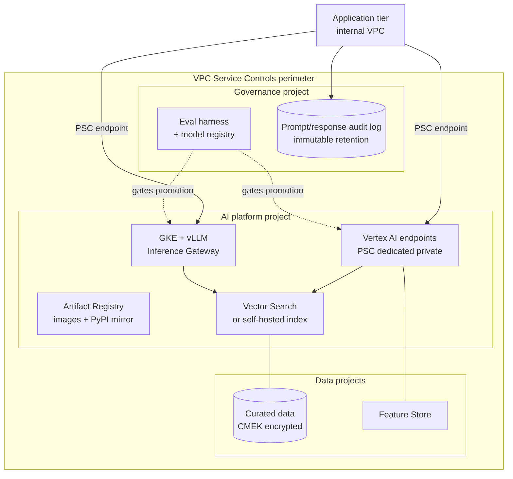

# GenAI and AI/ML Platform on GCP and AWS

"Enabling GenAI" is one of the four enterprise strategies cloud exists to serve.
This is the platform-architecture view: how to make AI workloads runnable,
private, governable and affordable — not how to build a model.

All figures sourced in `07-verified-facts.md`.

---

## 1. The Platform Question, Not the Model Question

Workload teams ask "which model?". The platform architect's questions are:

1. **Where does the data go, and can it leave?** This decides everything else.
2. **Is the inference path private?** Public endpoints are usually a non-starter
   for a financial data firm.
3. **Who can call it, and is that logged?** Entitlement and audit, same as any
   other data path.
4. **What does it cost per unit of business value?** Tokens and GPU-hours, mapped
   to something the business recognises.
5. **How is the model governed?** Versioning, evaluation, approval, monitoring —
   this is model risk management, and regulators have opinions.

Answer those five and the model choice becomes a swappable detail. That is the
point: build the platform so models are replaceable.

---

## 2. Serving Options — Choose by Shape of Demand

### Google Cloud

| Option | Use when | Characteristics |
| --- | --- | --- |
| **Vertex AI** (managed endpoints, Model Garden, Gemini) | Standard inference and managed model lifecycle | Fastest path. Supports batch and online inference, custom training, Pipelines, Vector Search, Feature Store, Agent Engine — all VPC-SC protectable |
| **GKE + vLLM/SGLang + GKE Inference Gateway** | High-throughput self-hosted LLM serving; you want control over the runtime and the GPUs | The Inference Gateway does model-aware and **KV-cache-aware routing** rather than round-robin. On a shared-prefix workload this is the difference between wasting ~88% of GPU prefill and ~12% |
| **Cloud Run with GPUs** | Bursty or intermittent inference; small models; internal tools | **NVIDIA L4**, GA since June 2025. **Scales to zero**, cold start under 5 seconds to a GPU-ready instance, per-second billing. Limited region set — check before designing |
| **Vertex AI batch inference** | Offline scoring over large datasets | No endpoint to secure or scale |

### AWS

| Option | Use when |
| --- | --- |
| **Bedrock** | Managed foundation models with guardrails; the Vertex-equivalent fast path |
| **SageMaker** | Custom training and hosting, MLOps pipelines |
| **EKS + vLLM** | Self-hosted serving where you want runtime control |
| **Lambda** | Light orchestration, embedding calls, agent glue — not model hosting |

### The decision rule

- **Intermittent, low-volume, or internal tooling** → Cloud Run GPU (scale to
  zero is the whole argument) or a managed endpoint.
- **Sustained high throughput with shared prompt prefixes** (RAG over a common
  corpus, agents with a large system prompt) → GKE + Inference Gateway. The
  cache-aware routing gain is largest exactly in this shape.
- **Standard model, no special runtime need** → Vertex AI or Bedrock. Do not
  self-host to save money you will spend on operations.
- **Batch scoring** → batch inference. Never stand up an endpoint for a nightly job.

---

## 3. Private Inference — The FSI Non-Negotiable

Public inference endpoints are rarely acceptable for a financial data firm.
Design for private from the start; retrofitting is painful.

### Google Cloud

| Mechanism | What it gives |
| --- | --- |
| **Dedicated private endpoints based on Private Service Connect** | The recommended pattern for online inference. Dedicated connectivity rather than shared infrastructure, no public IP exposure, traffic over Google's internal network. Preferred over private services access / VPC peering — less contention, simpler operations |
| **Private services access (VPC peering)** | Older pattern; still required by some services (e.g. Vertex AI Pipelines needs "VPC Service Controls for peerings" enabled) |
| **VPC Service Controls** | Perimeter around the Vertex AI API so training data, models, inference requests and results cannot leave. Covers batch and online inference, custom training, Pipelines, Vector Search, Feature Store, generative models, managed training clusters and Agent Engine |

### AWS

- **VPC interface endpoints (PrivateLink)** for Bedrock and SageMaker
- **SageMaker Unified Studio supports PrivateLink** (January 2026)
- Endpoint policies plus `aws:PrincipalOrgID` conditions to scope who may call
- Bedrock **Guardrails** for content and topic policy enforcement

### VPC-SC with Vertex AI — the limitations that bite

Know these before promising a perimeter:

- **VPC-SC blocks public internet access by default.** Authorised external users
  need an explicit access-level allowlist.
- **Custom pipeline components cannot install packages from public PyPI.** You
  need an internal mirror (Artifact Registry remote repository). This surprises
  data science teams badly — solve it before they hit it.
- **Endpoints must be created after** the project is added to the perimeter.
- **Agents must be deployed after** perimeter enrolment.
- **Model Garden public endpoint deployments are not supported** inside a
  perimeter.
- **PSC interface + VPC-SC** requires a proxy server inside the perimeter on an
  RFC 1918 subnet, plus Cloud NAT for egress.
- Data labelling requires labeller IPs on the access level.

**Architectural consequence:** stand up the internal package mirror, the proxy
and the access-level model *as part of the AI platform*, not as a later fix. The
platform team owning those is what makes the perimeter tolerable for the data
scientists.

---

## 4. Reference AI Platform Architecture

Design points:

- **Perimeter first.** Everything that touches model inputs or outputs lives
  inside it.
- **The audit log of prompts and responses is a records-management artefact**, not
  a debug convenience. If a model output influenced a client-facing decision, the
  firm needs to be able to reconstruct it. Apply the same immutable retention as
  other regulated records — see `04-security-compliance-fsi.md` §2.
- **The eval harness gates promotion.** No model reaches a production endpoint
  without a passing evaluation recorded against a version.
- **The package mirror is platform infrastructure.** Without it the perimeter
  blocks the data scientists and they route around you.

---

## 5. Retrieval and Data Boundaries

The most common way a GenAI system leaks is not the model — it is retrieval
returning documents the caller was never entitled to see.

- **Enforce entitlements at retrieval time**, filtering the index by the caller's
  permissions before results reach the model. Post-filtering the model's answer
  is not a control.
- **Partition indexes by data classification** where the entitlement model is
  coarse. One index per trust boundary is cheaper than one leak.
- **Never embed data into a shared index that crosses a licensing boundary.**
  Market data licensing constrains derived data too — see
  `03-low-latency-market-data.md` §7. Embeddings of licensed content are derived
  data. Check before indexing.
- **Log what was retrieved**, not just what was answered. Incident response needs
  the retrieval set.

---

## 6. AI Governance for a Financial Firm

### The regulatory picture

| Regime | Status and what it requires |
| --- | --- |
| **EU AI Act — transparency obligations (Art. 50)** | **2 August 2026 — active**, unchanged by the Omnibus agreement. Watermarking has a grace period to **2 December 2026** |
| **EU AI Act — high-risk, Annex III (stand-alone)** | Postponed from 2 Aug 2026 to **2 December 2027** by the Omnibus provisional agreement (6 May 2026) |
| **EU AI Act — high-risk, Annex I (embedded in regulated products)** | Postponed from 2 Aug 2027 to **2 August 2028** |
| **SR 11-7 / model risk management** (US banking supervisory guidance, widely adopted as the market standard) | Model inventory, development documentation, independent validation, ongoing monitoring, governance and controls |
| **DORA** | AI systems supporting critical functions fall inside ICT risk management and third-party risk — including the model provider |
| Existing regimes | Records retention, data residency, client-data confidentiality apply unchanged to AI systems |

The postponement of high-risk deadlines removes deadline pressure, not the
requirement. Build the governance capability on the SR 11-7 shape and the AI Act
obligations become largely a documentation exercise on top.

### What the platform must provide

- **Model inventory** — every model in use, its version, owner, purpose, data
  and approval status. Automated from the registry, not a spreadsheet.
- **Versioned, immutable prompts and configurations.** A prompt change is a model
  change.
- **Evaluation and regression suites** run on every promotion, results retained.
- **Monitoring** for drift, refusal rates, latency and cost, with alerting.
- **Human-in-the-loop and override paths** for anything client-affecting.
- **Third-party model provider risk** captured in the ICT register.
- **Traceability**: for any output, the model version, prompt version, retrieval
  set and caller identity.

**Give teams this as platform capability.** If governance is a checklist teams
must implement themselves, they will implement it inconsistently and you will
discover that during an audit.

---

## 7. Cost Control for AI Workloads

AI spend grows faster than any other cloud line item and does so quietly.

| Lever | Effect |
| --- | --- |
| **Right serving option** | Cloud Run GPU scale-to-zero eliminates idle GPU cost entirely for intermittent workloads. An always-on endpoint for a workload used twice a day is the most common waste |
| **Cache-aware routing** | On shared-prefix workloads, KV-cache-aware routing recovered ~3.1× effective throughput versus round-robin by eliminating redundant prefill — that is GPU capacity you do not have to buy |
| **Prompt caching and context discipline** | Long system prompts re-sent per request are pure waste |
| **Right model size** | The largest model is rarely the right default. Route by task complexity |
| **Batch where latency permits** | Batch inference is materially cheaper than endpoint inference |
| **Commitments on the stable base** | GPU capacity that runs continuously should be committed, not on-demand |
| **Egress awareness** | Managed control planes carry an egress markup at scale; model it, especially for cross-cloud or high-volume response payloads |

**Unit economics to publish:** cost per 1,000 requests, cost per user per month,
cost per document indexed. Absolute AI spend is not a number anyone can act on.

---

## 8. Anti-Patterns

| Anti-pattern | What goes wrong |
| --- | --- |
| Public inference endpoints "for now" | Becomes permanent; fails the next security review; retrofitting the perimeter is a project |
| Perimeter enabled without an internal package mirror | Data science teams blocked, then granted exceptions, then the perimeter is meaningless |
| Round-robin load balancing in front of LLM replicas | Throws away KV cache; multiplies GPU cost for the same throughput |
| Always-on GPU endpoints for intermittent workloads | The single largest source of AI waste |
| Entitlement filtering applied to the model's answer instead of the retrieval | Leaks; and the leak is in the retrieval log, discoverable later |
| Embedding licensed market data into a shared index without a licensing check | Derived-data licensing exposure |
| Prompts stored in application code, unversioned | No reproducibility; fails model risk management |
| Model governance as a team-by-team checklist | Inconsistent, unevidenced, discovered at audit |
| Choosing the model before the data boundary | The boundary usually eliminates most of the options anyway |
