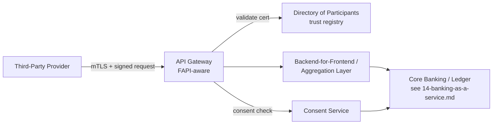

# Open Finance and Open Banking

For any workload that exposes account, payment-initiation or product data to
third parties under a regulatory open-data mandate — or consumes another
institution's data under the same. Brazil's Open Finance is the concrete,
deeply specified example here (relevant given the FactSet São Paulo context,
`00-role-context.md`); PSD2/UK Open Banking and the emerging US framework
(FDX/CFPB 1033) are noted for global context, since a market-data or fintech
platform serving multiple jurisdictions meets a different regime in each. All
figures here are sourced in `references/07-verified-facts.md`.

---

## 1. The Shape of Every Open Finance Regime

Despite different regulators, every regime converges on the same architecture:

1. **A directory of participants** — a trust registry naming who is
   authorized to call whose APIs, with certificates rooted to it.
2. **A security profile built on OAuth 2.0 / OpenID Connect**, hardened for
   financial-grade use (signed requests, short-lived tokens, strong client
   authentication) rather than consumer-web-grade OAuth.
3. **A consent model** — the end customer explicitly authorizes a specific
   third party to access specific data or initiate a specific payment, for a
   bounded time, revocable.
4. **A standardised API surface** — accounts, balances, transactions, and (in
   the more mature regimes) payment initiation.

The architecture question is always the same regardless of jurisdiction:
**where does the API gateway sit, how is the caller's certificate validated
against the directory, and how is consent enforced at the data layer, not
just at the API layer.**

---

## 2. Open Finance Brasil — the Specified Example

Brazil's regime (regulated by BACEN, the same regulator behind Resolution
4.893/2021 in `04-security-compliance-fsi.md`) publishes one of the most
technically precise security profiles of any open-data regime: **Open
Finance Brasil Financial-grade API (FAPI) Security Profile**.

**What it mandates:**

- **JWS/JWE on sensitive messages.** PS256 for signing, RSA-OAEP with
  A256GCM for encryption — mandatory digital signatures for integrity and
  non-repudiation on sensitive API calls, not just transport security.
- **Signed and encrypted request objects, or Pushed Authorization Requests
  (PAR).** Authorization servers must accept JWE request objects passed by
  value, or require PAR; confidential clients must encrypt request objects
  when not using PAR.
- **Transport security specifics**, not just "use TLS": TLS 1.2+ restricted
  to `TLS_ECDHE_RSA_WITH_AES_128_GCM_SHA256` and
  `TLS_ECDHE_RSA_WITH_AES_256_GCM_SHA384`, with session resumption and
  renegotiation disabled.
- **Two authentication levels** — LoA2 (single-factor) and LoA3
  (multi-factor) — selected by the sensitivity of the operation being
  authorized.
- **Dynamic Client Registration (DCR)**, per RFC 7591/7592, with encryption
  keys registered via `jwks_uri` at enrollment — a participant does not get a
  manually-provisioned static client, it registers programmatically against
  the directory.
- **Short-lived access tokens**: 300–900 seconds.
- **CPF/CNPJ claims** (individual/business tax IDs) carried in tokens for
  identity binding specific to the Brazilian regime.

Source: [Open Finance Brasil Financial-grade API Security Profile 1.0](https://openfinancebrasil.atlassian.net/wiki/spaces/OF/pages/240649123) ·
[Open Finance Brasil Dynamic Client Registration](https://openfinancebrasil.atlassian.net/wiki/spaces/OF/pages/1334116474)

**What this means architecturally:**

- The API gateway in front of any Open Finance-participating service needs to
  **validate JWS-signed request objects and issue JWE-encrypted responses**
  where mandated — a standard API gateway product handles this only with a
  purpose-built FAPI plugin/extension, not out of the box. Check before
  assuming your chosen gateway (Apigee, Cloud Endpoints, API Gateway,
  third-party) supports this natively.
- **Certificate lifecycle management is a first-class operational process**,
  not a one-time setup — DCR ties a client's registered `jwks_uri` to its
  live signing keys, and key rotation without a coordinated `jwks_uri` update
  breaks every counterparty's ability to validate your signatures.
- **Consent is a data-layer concern, not just an API-layer one.** A consent
  scope limits which accounts/products a token can see — enforce this in the
  service that reads the data store, not only in the gateway that issued the
  token, or a bug anywhere in the call chain becomes a data breach.

---

## 3. Other Regimes — Context, Not Depth

**PSD2 / UK Open Banking.** The UK's original Open Banking Implementation
Entity (OBIE) has been succeeded by **Open Banking Limited**, and as of
2025–2026 a "Future Entity" restructuring is in progress to establish the
long-term central standard-setting body — confirm current governance before
committing to a specific technical authority, this is actively in flux.
Technically, UK/PSD2 Open Banking follows the same OAuth2/OIDC-plus-directory
shape as Open Finance Brasil, historically with somewhat lighter
cryptographic mandates than the Brazilian profile, though FAPI 2.0 adoption
is tightening this across regimes generally.

Source: [Open banking – process to establish a Future Entity — Global Regulation Tomorrow](https://www.regulationtomorrow.com/2026/01/open-banking-process-to-establish-a-future-entity/)

**United States — FDX and CFPB Rule 1033.** No single regulator-run directory
equivalent to Brazil's; the Financial Data Exchange (FDX) publishes a common
technical standard, adopted voluntarily and increasingly referenced by
regulation. Treat any specific compliance-date claim for the US market as
needing a live check — this is one of the fastest-moving regulatory areas in
scope for this skill.

**Cloud provider framing.** AWS's own Financial Services Industry Lens names
the recurring architectural pattern without prescribing specific services:
OAuth 2.0 for consent, **mutual TLS for third-party access**, an API-driven
elastic environment, a Trust Service Provider (TSP) for certificate
management sitting between the consumer/third-party layer and the bank's own
environment. Google Cloud does not publish an equivalent named reference
architecture as of this writing — treat that as a documentation gap to check
for, not as evidence the pattern doesn't apply on GCP.

Source: [Open banking — AWS Financial Services Industry Lens](https://docs.aws.amazon.com/wellarchitected/latest/financial-services-industry-lens/open-banking.html)

---

## 4. Architecture Pattern

- **The API gateway is FAPI-aware**, terminating mTLS, validating signed
  request objects, and enforcing the directory-issued certificate chain —
  this is usually a dedicated layer (Apigee on GCP, API Gateway plus a
  signing/validation Lambda layer on AWS, or a specialist FAPI product), not
  the general-purpose ingress already used for everything else.
- **Consent is checked before the aggregation layer touches the core
  system**, and the consent scope is passed through to the core system so it
  can be enforced again at the data layer — defence in depth against a
  gateway-layer bug.
- **The core banking/ledger system is insulated from direct external
  exposure** — see `14-banking-as-a-service.md` for that layer specifically.

---

## 5. Review Checklist

1. Does the API gateway validate signed (JWS) request objects and enforce
   PAR, or is this regime's profile weaker than what's actually implemented?
2. Is the directory-of-participants certificate chain validated on every
   call, not cached indefinitely?
3. Is consent enforced at the data layer, not only at the gateway?
4. Is there a tested, non-manual process for key rotation that updates
   `jwks_uri` and every counterparty's cached copy?
5. For a multi-jurisdiction platform: is each regime's specific profile
   (Brazil FAPI vs UK/PSD2 vs FDX) implemented as its own configuration, not
   one profile stretched to fit all three?
6. Is the core banking/ledger system reachable only through the aggregation
   layer — never directly from the API gateway?
